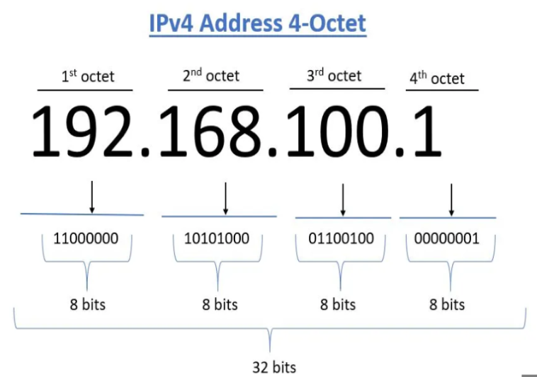
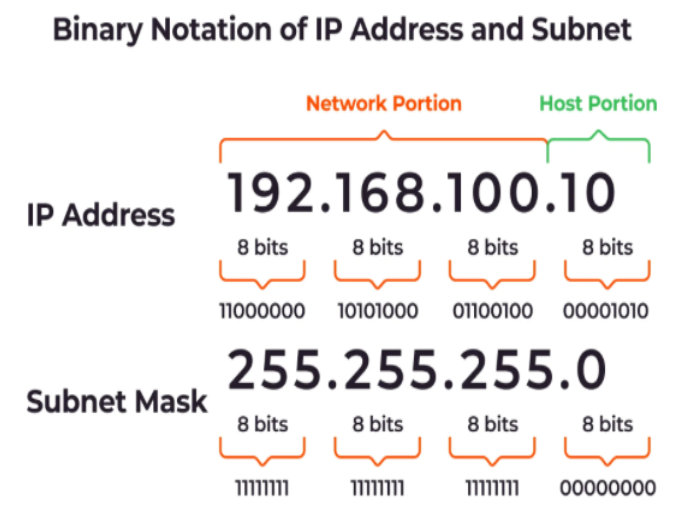
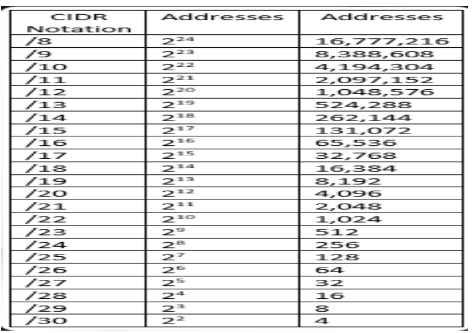
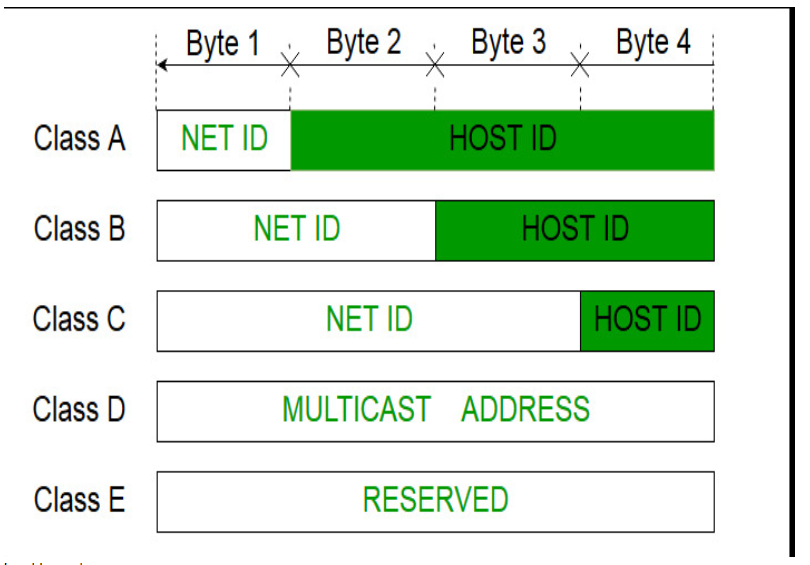
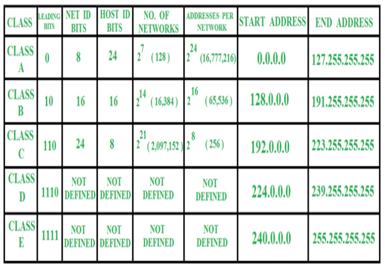

## UNDERSTANDING IP ADDRESSES AND CIDR

An Internet Protocol address (IP address) is a numerical label such as 192.168.2.89 that is assigned
to a device connected to a computer network that uses the Internet Protocol for communication.

IP addresses ae separated by periods and are sets of four numbers sometimes called octate. An
example is 192.168.2.456. Each number set can range from 0-255. They are allocated by the internet
assigned numbers authority (IANA), a division of the internet corporation for assigned names and
number (ICANN). ICANN is a non-profit organization that was established in the united states in 1998
to help maintain the security of the internet and allow it to be used by all.

## SUBNETTING AND SUBNET MASKS

Subnetting is the practice of dividing a network into smaller networks. It helps place a public IP
within a network and make multiple IP within that network. It divided the IP into network portion
and host portion.

Subnet Mask: A subnet mask distinguish between a network and a host address in IP address. It is
required on all class-based networks, even on networks that are not subnetted.

## CIDR Notation and Address Aggregation

CIDR stands for classless Inter-Domain Routing (CIDR). Its an IP allocation method that improves
data routing in the internet. Organizations uses CIDR to allocate IP addresses flexibly and
efficiently in their networks. CIDR is calculated based on the /n attached on an IP.

Example a class C IP 192.168.3.2/16 has a total of 65,534 hosts in the network.

since a subnet mast is 32 bits we do 32-16 = 16, 2 ^16 - 2 = 65,534

minus 2 is for the network and broadcast IPs.

### IP Aggregator

IP Aggregator is a utility developed to automate minimization process and convert bunch of IPv4
address into smallest continuous range possible. Commonly performed by network engineers working
with BGP & routers.

## IP Address Classes and Private IP Address Ranges

Classful addresses is a network address that was created in 1981. It was replaced by the classless
IP addresses. It divided the IP addresses into 5 separate classes. Class A, Class B, Class C, Class
D, and Class E. Class D and E is only used for multicast and experimental purposes respectively.

and

There are other advanced topics in network IP addressing like TCP/IP for managing and optimizing
network performance. VPN, Virtual Private Networks, which enable users to securely connect to
private network over the internet. DNS, stands for Domain Name System, which is a hierarchical,
distributed database that is used to translate human eadable domain names into machine-readable IP
addresses. NAT, Network Address Translation, which is a technique that is used to allow devices on a
private network to communicate with devices on a public network; and so on.
